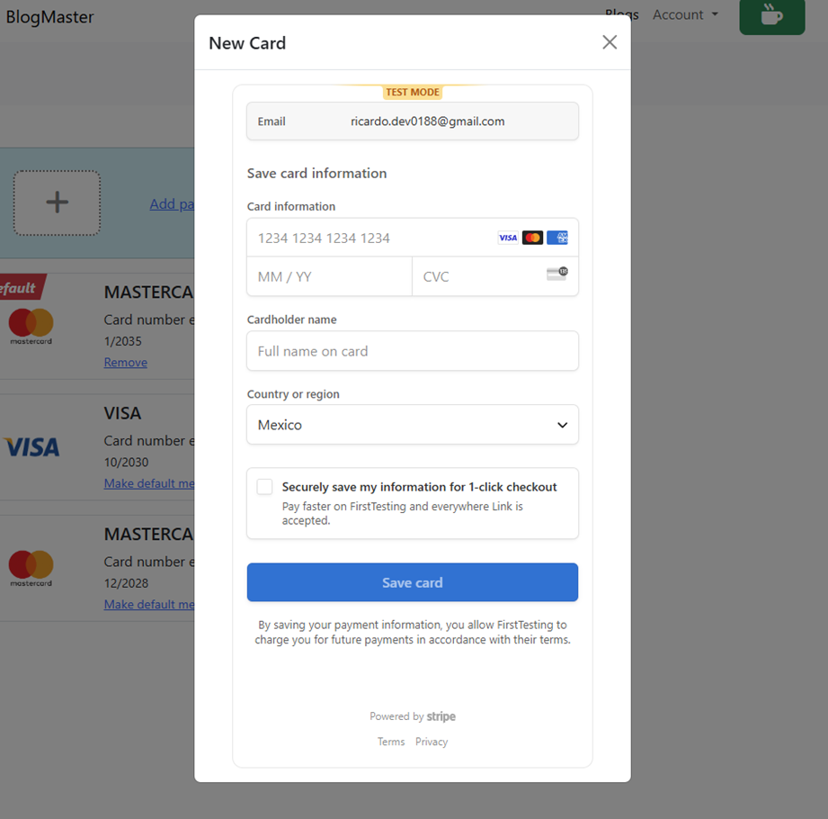
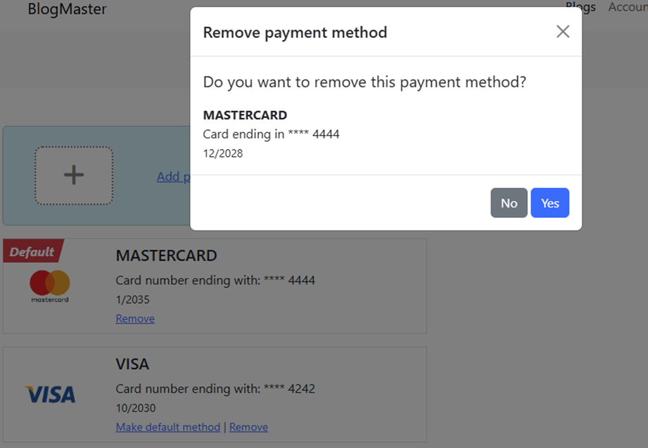

# BlogMaster

## Key Features/Functionality

- Views designed for administrators of the blog website
- Creatable users with roles for additional writers and editors with specific privileges
- Easily add, remove, edit, publish, and unpublish blogs with images
- Subscription system for users/customers, with different tier access layers, as well as a donation system

## Technology Stack

- **Front-end**: Server-side rendering with Razor views, JavaScript and Bootstrap for required functionality.
  - **Note**: Decided to go with Razor views (server-side rendering) instead of a SPA front-end framework like React because it’s a blog website and it may be better for search engine crawlers.
- **Back-end**: ASP.NET MVC design using a clean architecture (UI, Core, and Infrastructure class libraries), Entity Framework ORM with Identity Framework system for the database layer for user authorization and authentication.

## Getting Started

### Run the Application

To run the application, use the following command from the `BlogMaster` directory in your CLI:

```bash
dotnet run
```

### Application URLs

The application will run on either of the following URLs:

- `https://localhost:7218`
- `http://localhost:5048`

### Stripe and SMTP Server Configuration

Create a `Secret.json` file and add it to the `BlogMaster` directory with the following json information:

```json
{
  "EmailSettings": {
    "SmtpServer": "[YOUR-SMTP-SERVER].com",
    "SmtpPort": [YOUR-PORT],
    "UseSsl": [true/false],
    "Username": "[YOUR-USERNAME]",
    "Password": "[YOUR-PASSWORD]",
    "SenderEmail": "[YOUR-SENDER-EMAIL]"
  },
  "Stripe": {
    "PublishableKey": "[YOUR-PUBLISHABLE-KEY]",
    "SecretKey": "[YOUR-SECRET-KEY]",
    "SecretEndpoint": "[YOUR-SECRET-ENDPOINT]",
    "TestingEndpoint": "[YOUR-TESTING-ENDPOINT]"
  }
}
```

## Modeling Tables


### Seeding Admin Users

In `Models/ModelBuilderExtensions.cs`, you will find the data being seeded. Be sure to modify this information to suit your preferences.

**Default Admin User:**

- **Username**: Admin
- **Password**: adminpass

# BlogService Overview

The `BlogService`, defined by the `IBlogService` interface, serves as the central hub for managing all blog-related functionalities. It consolidates responsibilities for both **regular users** and **administrators**, making it the single source of truth for any blog-related operations.

## Key Responsibilities

1. **Blog Management**:  
   The service offers comprehensive CRUD operations for managing blogs, including retrieving individual blogs (by ID or slug), fetching paginated previews, and managing their publication and featured status. This is the primary resource for developers handling blog content.

   - **Look for**: Methods like `GetBlogByIdAsync`, `GetBlogBySlug`, and `CreateBlogAsync` for blog CRUD operations.
   - **Special Operations**: `PublishBlogAsync`, `UnpublishBlogAsync`, `FeatureBlogAsync`, and `UnfeatureBlogAsync` for visibility and prioritization.

2. **Relationship Management**:  
   Manage the relationships between blogs and their associated metadata such as **categories**, **tags**, **keywords**, and **comments**. These methods allow fine-grained control over linking and unlinking entities.

   - **Look for**: `AddCategoryToBlogAsync`, `RemoveTagFromBlogAsync`, and similar methods to manage relationships.

3. **Category, Tag, and Keyword Management**:  
   Administrators can manage metadata entities like categories, tags, and keywords using their respective CRUD methods.

   - **Look for**: Methods under the categories `Category Management`, `Tag Management`, and `Keyword Management`.

4. **Image Management**:  
   Provides utilities to attach and manage images for blogs, including retrieving all associated images or the first image for a blog.

   - **Look for**: `AddImageToBlogAsync`, `RemoveImageAsync`, `GetAllBlogImages`.

5. **Comment Management**:  
   Facilitates CRUD operations for comments on blogs and provides utilities to fetch comments for a specific blog or globally.

   - **Look for**: `GetAllBlogComments`, `CreateCommentAsync`, and `DeleteCommentAsync`.

6. **User-Focused Features**:

   - **Recommendations**: Retrieve personalized blog recommendations based on categories or preferences.
     - **Look for**: `GetBlogRecomendations`.
   - **Ratings**: Add, update, or retrieve blog ratings, including the average rating for a blog or a specific user’s rating.
     - **Look for**: `AddRatingToBlogAsync`, `GetBlogAverageRatingAsync`, `GetUserRatingOnBlog`.

7. **Audit and Modifications**:  
   Manage and track changes to blogs, including retrieving modification histories or updating them.

   - **Look for**: `GetBlogModificationsAsync`, `AddModificationToBlogAsync`.

8. **Search and Discovery**:  
   Supports advanced features such as keyword-based blog searches and utility functions for subscription requirements.

   - **Look for**: `SearchBlogsWithKeywordAsync`, `IsSubscriptionRequiredAsync`.

---

## How to Use BlogService

- **Administrator Tasks**:  
   Use methods like `CreateBlogAsync`, `PublishBlogAsync`, `FeatureBlogAsync`, and metadata management methods to manage blog content and metadata.  
   Example: Adding a new category or tagging blogs with relevant keywords.

- **User-Focused Tasks**:  
   Leverage methods like `GetBlogBySlug`, `GetBlogPreviews`, and `GetUserRatingOnBlog` to retrieve information and enhance the user experience.  
   Example: Displaying blog previews based on tags or fetching the average rating of a blog.

- **Utility Tasks**:  
   Methods like `IsSubscriptionRequiredAsync` or `GetFirstBlogImage` provide additional tools for integrating blog functionality into the broader system.  
   Example: Checking if a blog requires a paid subscription before rendering content.

---

## Why This Design Matters

- **Single Responsibility**:  
   Consolidates all blog-related operations in one service, ensuring clarity and reducing duplication.
- **Extensibility**:  
   Clear separation of concerns (CRUD, relationships, images, etc.) allows developers to find and extend functionality easily.
- **Reusability**:  
   Common methods like fetching blog previews or handling metadata relationships ensure the service is reusable across both admin and user-facing features.

# Stripe Payments Integration

This application integrates **Card Payments** using embedded sessions from the Stripe API.

### Payment Endpoints

In the `PaymentController`, you will find endpoints to handle both **donation** and **subscription** payments:

- **Subscription Checkout Page**: `"/checkout-subscription"`
- **Donation Checkout Page**: `"/checkout-donation"`

These pages display embedded payment forms fetched from the following endpoints:

- **Embedded Form for Subscription Checkout**: `"/checkout-session-subscription"`
- **Embedded Form for Donation Checkout**: `"/create-checkout-session-donation"`

### Payment Method Management

A separate form for adding new payment methods (credit cards) is located in the `SubscriptionController`:

- **Payment Methods Page**: `"/payment-methods"`
- **Endpoint for Adding New Payment Methods**: `"/create-payment-method"`

The `/create-payment-method` form is embedded in a modal that opens when the "Add Payment Method" button is clicked.




### Payment Handling and Card Management

The `"/payment-return"` endpoint handles responses from Stripe when new cards are added. Initial subscription and donation payments automatically save the user's card as a payment method, which can later be managed and removed on the Payment Methods page.



## Stripe Business Logic

All Stripe-related functionality, including monthly subscription payments and paywalled blog access, resides in the `StripeService` class (interfaced by `IStripeService`). This service class is responsible for communication with the Stripe API.


**Note**: `StripeService` currently contains two hardcoded properties:

- **Price**: Defines the cost of the subscription.

These values can be updated in `StripeService` for different pricing and domain configurations.

## Use Diagram


